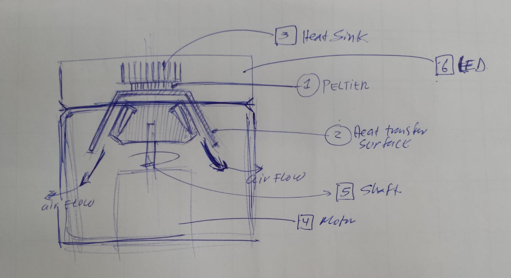

# Peltier on led floating close to sample
#### Name: Santosh
#### Date:

## 1. Concept-for-solution:
The peltier doesn't touch the sample. It starts cooling when it rotates, air is cooled with the peltier and that air cools the sample. The concept the faster it rotates the faster it will cool down. Thermo couple will measure the temperature and will compare to the set value of temperature.

## 2. To verify that we will do the following test:
## Checklist for experiment:
Based on the temperature range (what thermo couple is able to measure), we decide the type of it.

## Materials:
- [K type](https://en.wikipedia.org/wiki/Thermocouple), should do the job. Is the cheapest and most commonly used.
- [Cooling kit that incldes peltier, heatsink, fan,and more.](https://www.amazon.de/dp/B01M5DX5KT?tag=tv-auto-20)
## 3. What are you going to measure
## Checklist:
- [ ] How much data
- [ ] How much time does it takes

## 4. Your experiment is successful if:
- We are able to cool the samples in less than 5 minutes to the target temperature set by the user.
- The temperature of the samples remain constant.

# Implementation notes
## Usage considerations:
3. The chamber needs to be already cooled before we put the samples.
2. Therefore in this concept, the user would have to first cool the system,
3. Then open the led to place the sample.
4. And start centrifuging.

## Architecture and layout model test:

## How to measure temperature
**Options/Ideas:**

a. Wireless temperature sensor touching one of the samples, mounted on the rotor.

b. 
