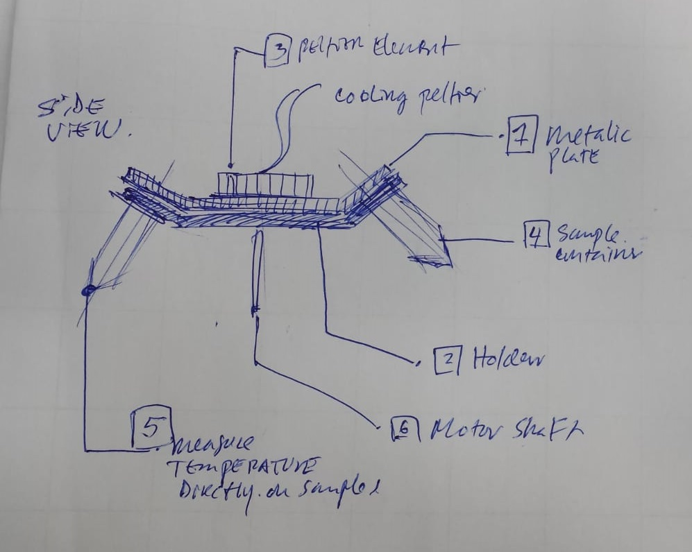

#TEST:30 ## Cooling-lead
#### Name: Jose
#### Date: 7-6-2019

## 1. Concept-for-solution:
A peltier element `3` can be placed on a metal surface `1` that is in direct contact with the samples reservoir`4`. The samples cooled via this setup and the cooling mechanism decouples before the centrifuge starts to rotate.

## 2. To verify that we will do the following test:

- The setup is going to be isolated in a box.
- Metalic plate is in contact with each sample.
- There are 12-24 samples in the test case.
- A sensor senses ambient temperature in the box.
- Another sensor measures directly on one of the samples.

### Checklist for experiment:
- [ ] Use an image to explain the setup
- [ ] What are the materials needed.
  - temperature sensor to measure directly the sample reservoir
- [ ] Which materials need to be ordered
- [ ] How expensive is it roughly

## 3. What are you going to measure
- Measure inner temperature in sample
  - Must calculate the inner temperature of the sample, not the outer of  the sample reservoir. Calculate this based on the material.
  - Heat transfer considerations.
- Measure samples also after being centrifuged.

## 4. Your experiment is successful if:
- The temperature doesn't go bellow 4 degrees
- The temperature stays stable for
